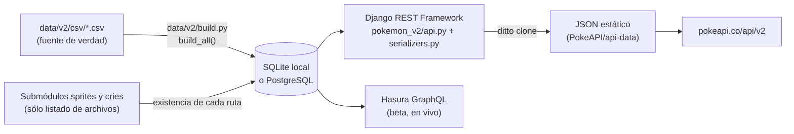

# 01 — Estructura de PokeAPI

Análisis del repositorio local en el commit `bc92d3b6` (30/09/2026). El remoto `origin` apunta a
`Plathinnum/pokeapi`; no hay un remoto `upstream` configurado hacia `PokeAPI/pokeapi`.

## Resumen

PokeAPI es una aplicación Django de sólo lectura. Su fuente de verdad son 187 archivos CSV en `data/v2/csv/`; un script
los carga en una base de datos y Django REST Framework los expone como JSON. En producción, pokeapi.co **no sirve la
API REST desde Django en vivo**: genera una copia estática de todas las respuestas y la publica como archivos JSON.

## Pila y versiones

| Pieza               | Versión / valor                                                                            |
| ------------------- | ------------------------------------------------------------------------------------------ |
| Python              | `>=3.10,<3.15`; `.python-version` fija 3.14; CI prueba 3.10 a 3.14                          |
| Gestor de entorno   | `uv` 0.11.19 (`make install`, `uv.lock` bloqueado)                                         |
| Framework           | Django 5.2.10, Django REST Framework 3.16.1, drf-spectacular 0.29.0                         |
| Caché               | django-redis + django-cachalot (caché de consultas ORM); `DummyCache` en `config.local`     |
| Base de datos       | SQLite en `config.local`; PostgreSQL 18 en Docker Compose y Kubernetes                     |
| Servidor            | Gunicorn (`gunicorn.conf.py`, puerto 80) detrás de nginx                                   |
| GraphQL             | Hasura 2.50.2 sobre la misma base (`graphql/v1beta`, `graphql/v1beta2`)                    |
| Calidad             | ruff (lint y formato), ty (tipos), pre-commit, `manage.py test`                            |
| Versión de la API   | 2.10.0 (`pyproject.toml` y `SPECTACULAR_SETTINGS`)                                         |

## Estructura de carpetas

| Ruta                       | Responsabilidad                                                                                                  |
| -------------------------- | ---------------------------------------------------------------------------------------------------------------- |
| `config/`                  | Settings de Django: `settings.py` (producción), `local.py` (SQLite, sin caché, DEBUG), `docker_compose.py`, `docker.py`, URLs y WSGI/ASGI. |
| `pokemon_v2/models.py`     | ~2.200 líneas; un modelo por tabla CSV.                                                                          |
| `pokemon_v2/serializers.py`| ~3.750 líneas y 232 serializadores; definen el contrato JSON de cada recurso (resumen y detalle).                 |
| `pokemon_v2/api.py`        | Viewsets de sólo lectura, búsqueda por ID o nombre, endpoint `meta` y `pokemon/{id}/encounters`.                 |
| `pokemon_v2/urls.py`       | Registro de los 49 recursos REST bajo `/api/v2/`.                                                                |
| `pokemon_v2/tests.py`      | ~5.300 líneas de pruebas de la API; `test_models.py` prueba modelos.                                             |
| `pokemon_v2/migrations/`   | Migraciones del esquema.                                                                                         |
| `data/v2/csv/`             | 187 CSV, origen histórico en veekun/pokedex (`make sync-from-veekun`).                                           |
| `data/v2/build.py`         | Borra y reconstruye cada tabla desde los CSV; resuelve las URLs de sprites y cries.                              |
| `data/v2/sprites`, `cries` | Submódulos Git (`PokeAPI/sprites`, `PokeAPI/cries`). **No están inicializados en este clon.**                    |
| `graphql/`                 | Metadatos de Hasura y ejemplos de consultas.                                                                     |
| `Resources/`               | Dockerfile, compose de producción, nginx, Kubernetes (kustomize), kind, GCP y scripts de datos y despliegue.     |
| `openapi.yml`              | Esquema OpenAPI 3.1 generado con `make openapi-generate`.                                                        |

## Comportamiento de la API REST

- **Sólo `GET`.** `CORS_ALLOW_ALL_ORIGINS = True`, `CORS_ALLOW_METHODS = ("GET",)` y `CORS_URLS_REGEX = ^/api/.*$`.
- **Búsqueda por ID o nombre.** `NameOrIdRetrieval` acepta un entero o un nombre que cumpla `^[0-9A-Za-z\-\+ ]+$`
  (comparación sin distinguir mayúsculas).
- **Barra final.** Las rutas canónicas terminan en `/`; `CommonMiddleware` redirige `/api/v2/pokemon/1` a
  `/api/v2/pokemon/1/` (`APPEND_SLASH` por defecto).
- **Paginación.** `LimitOffsetPagination` con 20 resultados por defecto; los listados devuelven `count`, `next`,
  `previous` y `results` (`name` y `url`).
- **URLs absolutas.** Los campos `url` se construyen con el host de la petición (`HyperlinkedIdentityField`). Un mismo
  build servido desde otro dominio publica URLs de ese dominio.
- **Filtro `?q=`.** Filtra listados por nombre, pero sólo existe en Django: la documentación lo marca como «no
  disponible en pokeapi.co».
- **`/api/v2/meta/`.** Lee el commit, la fecha y la etiqueta desde `git`; por eso la imagen Docker instala `git`.

## Construcción de la base (`build_all`)

`build_all()` recorre 25 grupos (idiomas, regiones, generaciones, versiones, estadísticas, habilidades, objetos, tipos,
movimientos, Pokémon, encuentros, etc.). Cada tabla se vacía y se repuebla en lotes de 200 filas, y se reinician los
contadores de ID. Consecuencias para el fork:

- **Los CSV son la única fuente.** Cualquier dato del fork entra como filas de CSV; no hay migraciones de datos ni
  edición manual en la base.
- **Los IDs son los de los CSV.** La base no genera IDs propios: los `pokemonId`, `formId`, `move_id`, etc. dependen
  sólo del contenido de los CSV. Existe `Resources/scripts/data/shift_ids.py`, señal de que PokeAPI original ha
  renumerado IDs en el pasado.
- **Sprites y cries dependen del submódulo.** `file_path_or_none` sólo publica una URL si el archivo existe en
  `data/v2/sprites/sprites/` o `data/v2/cries/cries/`. **Sin los submódulos, todos los campos de sprites y cries salen
  en `null`.**
- **Prefijos configurables.** Las URLs se arman con `POKEAPI_SPRITES_PREFIX` (por defecto
  `https://raw.githubusercontent.com/PokeAPI/sprites/master/sprites/`) y `POKEAPI_CRIES_PREFIX` (por defecto
  `https://raw.githubusercontent.com/PokeAPI/cries/main/cries/`). Cambiarlas permite servir las imágenes desde
  infraestructura propia sin tocar código.
- **Configuración central de sprites (desde el 24/09/2026, #1681).** `POKEMON_SPRITE_CONFIG` describe todas las
  colecciones (`home`, `official-artwork`, `showdown`, versiones por generación, incluida
  `generation-ix/champions`). Las formas no predeterminadas buscan `{pokemon_id}-{form_identifier}` en todas ellas, lo
  que puede cubrir los sprites HOME por forma que hoy poke-generator completa con un manifiesto propio
  (ver [03](03-extensiones-a-migrar.md#8-sprites-de-pokémon)).
- **Objetos.** `ItemSprites` sólo resuelve `items/{identifier}.png`; no considera las carpetas `items/gen8` ni
  `items/gen9` del repositorio de sprites.

## Cómo publica PokeAPI original

| Canal                  | Mecanismo                                                                                                                                                                                                                       |
| ---------------------- | ------------------------------------------------------------------------------------------------------------------------------------------------------------------------------------------------------------------------------- |
| REST en pokeapi.co     | CircleCI (`deploy`, ramas `master` y `staging`) ejecuta `Resources/scripts/updater.sh`: construye la base, recorre la API con `ditto`, empuja JSON a `PokeAPI/api-data` (rama `staging`) y abre un PR hacia su `master`. Otro repositorio (`PokeAPI/deploy`, no incluido aquí) lo publica. |
| Base descargable       | `.github/workflows/release.yml` publica `pokeapi.pgdump` y `db.sqlite3` en la release `master-branch`. Se omite en forks (`if: !github.event.repository.fork`).                                                                  |
| Imagen Docker          | `docker-build-and-push.yml` publica `pokeapi/pokeapi` en Docker Hub con secretos propios. Se omite en forks.                                                                                                                    |
| GraphQL beta           | Hasura en vivo sobre PostgreSQL (`make update-graphql-data-prod`), con logs en GCP.                                                                                                                                             |

`database.yml` ya contiene el patrón que el fork puede reutilizar: levanta la API, exporta la base y la recorre con
`uvx --from pokeapi-ditto ditto clone --src-url http://localhost/ --dest-dir ./out`.

**A confirmar:** la copia estática de pokeapi.co resuelve también búsquedas por nombre y parámetros `limit`/`offset`.
Ese comportamiento vive en `PokeAPI/deploy`, que no está en este workspace; cualquier hosting estático del fork debe
reproducirlo (ver [02](02-compatibilidad-poke-generator.md#opciones-de-publicación)).

## Dependencias y enlaces externos

| Dependencia                                   | Dónde                                                    | Uso                                              | Impacto en el fork                                                                 |
| --------------------------------------------- | -------------------------------------------------------- | ------------------------------------------------ | ---------------------------------------------------------------------------------- |
| `github.com/PokeAPI/sprites` (submódulo)       | `.gitmodules`, `build.py`                                | Existencia de archivos y URLs publicadas          | Necesario para construir; es un repositorio grande. Las URLs apuntan a GitHub raw. |
| `github.com/PokeAPI/cries` (submódulo)         | `.gitmodules`, `build.py`                                | Campo `cries`                                    | poke-generator no lo usa; puede quedar sin inicializar si se aceptan `cries` nulos. |
| `raw.githubusercontent.com` (prefijos)         | `build.py`                                               | URLs dentro de las respuestas                    | Configurable por variables de entorno.                                            |
| `PokeAPI/api-data`, `PokeAPI/deploy`           | `updater.sh`, `Makefile`                                 | Publicación de pokeapi.co                        | El fork no debe ejecutar `updater.sh`: empuja a repositorios de PokeAPI.          |
| Docker Hub (`postgres`, `redis`, `nginx`, `hasura`, `pokeapi/pokeapi`) | `docker-compose*.yml`, Dockerfile, kustomize | Entornos Docker y Kubernetes                     | `docker-compose.override.yml` usa la imagen oficial `pokeapi/pokeapi:master`, no la del fork. |
| `ghcr.io/astral-sh/uv`                         | Dockerfile                                               | Instalación de dependencias                      | Ninguno.                                                                           |
| PyPI (`pokeapi-ditto`, dependencias)           | `database.yml`, `uv.lock`                                | Rastreo estático y paquetes                      | Ninguno.                                                                           |
| `github.com/Clever/csvlint`                    | `database.yml`                                           | Validación de CSV en CI                          | Ninguno.                                                                           |
| API de GitHub, CircleCI, GCP                   | `updater.sh`, `.circleci/config.yml`, compose de producción | Despliegue y registros de PokeAPI original       | Credenciales y proyectos ajenos; no aplican al fork.                              |
| Bulbapedia, pokeapi.co/docs                    | `SPECTACULAR_SETTINGS`, `openapi.yml`                    | Enlaces de documentación                         | Sólo texto.                                                                        |
| `../pokedex` (veekun)                          | `Makefile`                                               | Sincronización histórica de CSV                  | No se usa en el flujo actual.                                                      |

## CI y flujo de contribución

| Workflow                     | Disparador                                             | En el fork                                                                 |
| ---------------------------- | ------------------------------------------------------ | -------------------------------------------------------------------------- |
| `code-quality.yml`           | PR o push (no `master`/`staging`) que toque `.py`, `.toml`, `.lock`, `Makefile` | Se ejecuta; ruff y ty son informativos (`continue-on-error`).             |
| `database.yml`               | Además, `data/**`, Docker y nginx                      | Se ejecuta: csvlint, OpenAPI, SQLite 3.10 a 3.14, PostgreSQL y `ditto`.    |
| `docker-k8s.yml`             | PR con cambios de código, datos o infraestructura      | Se ejecuta (build multiplataforma y clúster kind).                        |
| `nix-environment.yml`        | PR o push a `master` con código                        | Se ejecuta.                                                                |
| `release.yml`, `docker-build-and-push.yml` | Push a `master`/etiquetas                | **Se omiten en forks.**                                                    |
| CircleCI                     | Todas las ramas                                        | Sólo corre si se conecta el fork a CircleCI. Su job `deploy` no debe usarse tal cual. |

Los cambios bajo `docs/` no coinciden con ningún filtro de rutas, así que no disparan CI. Sí aplican los hooks de
pre-commit (`end-of-file-fixer`, `trailing-whitespace`). `.dockerignore` excluye `/*.md` de la raíz pero no `docs/`:
la carpeta se copiaría en la imagen Docker; conviene añadirla a `.dockerignore` si el fork publica imágenes.

`CONTRIBUTING.md` exige pruebas nuevas para cada funcionalidad, revisión humana verificable del código asistido por IA
y la declaración de esa asistencia en el PR (plantilla `.github/pull_request_template.md`). Si el fork propone cambios
aguas arriba, debe cumplir esa política.

## Estado del entorno local (03/10/2026)

- Python 3.14.3 y Docker disponibles; `uv` **no** está instalado.
- Submódulos `data/v2/sprites` y `data/v2/cries` sin inicializar (carpetas vacías).
- No existe `db.sqlite3`: la base nunca se construyó en este clon.
- Rama `master` limpia y al día con `origin/master`.
